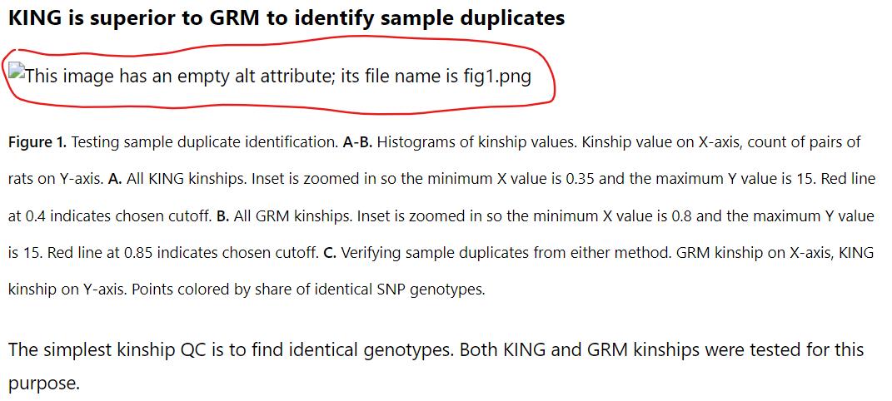

# So you want to write a blog post

Hello there! I'm [Faith][FaithORCID], currently the only person who's written a
blog post for Palmer Lab. All [blog posts][Blog] may be found by clicking "Blog"
at the top of <https://palmerlab.org> (under-the-hood they're a category called
"Internal Project Writeups"). Here I'll walk you through making your own blog
post, which I also sometimes call a "writeup". Anyway, let's go :D

## What to write about

Before you start writing, you should have a firm topic idea. Examples by me:

- Testing modifications of our standard pipelines.
    * [How does random tie-breaking during quantile normalization affect GWAS?][QNorm]
    * [Should GWAS in HS rats use PCs as covariates?][Covars]
- Evaluating Palmer Lab datasets.
    * [Where do HS rat genotypes have gaps?][Gaps]
- Developing a tool.
    * [Detecting errors by using albinism][Albino]
    * [Detecting errors by using genotype kinships][Kinship]
    * [Converting GFF3 to refFlat][RefFlat]
- Mini journal article: analysis to investigate a scientific question.
    * [Recombination desert on HS rat Chromosome 13][Inversion]

You should be able to answer the following questions:

1. What goal drove this project?
2. Why should Palmer Lab/others care about that goal?
3. How did you go about that goal?
4. What did you learn? What does it mean? Did you achieve the goal?

I don't recommend starting a writeup if you don't know the project's endpoint.
But, if you're doing so, then you only need to have solid answers for #1 and #2.
You should have a plan for #3, and be flexible about what #4 contains.

## What medium to write in

You've got a topic, now put (virtual) pen to paper. Two obvious options:

- [**Markdown**][Markdown]. This is what I used. If you're using my template,
then it's probably the option you're using. I prefer Markdown since the writeup
could go in my project directory, like my code and data. Pros include easy
formatting with only a keyboard and simple image handling (copy-paste in/out).
- [**Google Docs**][Docs]. If you prefer this, copy-paste the template into a
blank document. You'll have to adjust the formatting, unless you copy-paste a
rendered version (see "How to publish" #4). Pros include easy collaboration,
such as document sharing and commenting.

I don't much recommend LaTeX, as it's harder to get WordPress to play nice with.
I am quite literally not familiar enough with any other rich-text editors to
discuss them.

## Style guide

Blog posts aren't picky about technical aspects of writing: word choice, Oxford
commas, passive/active voice, formality, etc. If it's understandable, it's fine.

All of my blog posts are vaguely stuffy/academic because that is legitimately
what's most comfortable for me in that context. These instructions are written
in a more familiar voice, but this voice would also be fine for a blog post.

### Must include

- **At the top** (before even the introduction)
    * A title. Keep it to-the-point.
    * Your name. Link your [ORCID][ORCID], if you have one
    * Dates for the writeup and, if different, the project it presents
- **Introduction**. Points #1 and #2 from "What to write about".
- **Materials & Methods**.
    * If you used data, describe it. Is it archived? Was it filtered? etc.
    * Technical specifications, such as software versions.
- **Results/Discussion**. (If applicable. Can be split up, if that's better.)
- **Conclusion** (if applicable)
- **References** (in small text, e.g. `small text`)
- Also, **abbreviation definitions**. The first time you use an abbreviation,
even if it's common in the lab (e.g. SNP), write it out in full. For example:
    > single nucleotide polymorphism (**SNP**)

### Recommended

- **Figures**. Include as needed. Figure captions should be in small text.
- **Links**. This is meant to be read on the Internet. Be liberal with links.
Link to walkthroughs, definitions, lab pages, article DOIs, softwares, etc.
- **Code/Data**. When possible, deposit relevant code and data for other
labmembers, e.g. [GitHub][PalmerGitHub]. Include a [README][HowToREADME].

Feel free to add/remove sections as makes sense for your writeup. For example,
my article "[Converting GFF3 to refFlat][RefFlat]" used sections for
"Introduction", "File formats", "Conversion method", and "Code". There are no
"Materials & Methods", "Results/Dicussion", or "Conclusion" sections. The latter
three sections might properly be called the Methods section, but as the article
is *all* methods, it behooves it to be split up further. 

## How to publish

Now you have a finished draft. Before you post it, **have someone else review**
the writeup. I'm sure you're fine at editing, but new eyes help catch those last
few problems before releasing text to the world. Now, to publish:

1. [Log in][Login] to the WordPress site. If you don't have credentials, contact
April (akjones@health.ucsd.edu).
2. Create a new post in "Posts" -> "Add New Post" on the left sidebar.
    > 
3. Copy-paste your title into the top block. Do not make a new title block.
    > 
4. Copy-paste formatted text for the body of the blog post, below the title. For
Google Docs this is your document. For Markdown, you'll have to render the text.
In VS Code on Windows, hit Control-Shift-V (i.e. show preview).
5. Fix the images. For each image block, select the broken image, and insert the
new image. Copy-paste worked fine for me.
    > 
6. Fix the tables. Table captions will have been separated from their tables;
simply cut and paste them to the correct location.
    > 
7. Prepare an excerpt. This blurb will show up in the list of blog posts. I used
parts of Introduction.
    > 
8. Select the category "Internal Project Writeups"
    > 
9. Select to hide this blog post from the front page. You'll probably have to
scroll down in the right sidebar to get to the option.
    > 
10. Final check. Read everything again. Make sure no problems remain and nothing
was messed up in the transfer to WordPress.
11. Publish! The button is in the top right.
    > 

Congrats! You've published a blog post.

[Albino]: https://palmerlab.org/detecting-errors-by-using-albinism/
[Blog]: https://palmerlab.org/category/internal-project-writeups/
[Covars]: https://palmerlab.org/should-gwas-in-hs-rats-use-pcs-as-covariates/
[Docs]: https://docs.google.com/
[FaithORCID]: https://orcid.org/0009-0007-4163-6928
[Gaps]: https://palmerlab.org/where-do-hs-rat-genotypes-have-gaps/
[HowToREADME]: https://www.makeareadme.com/
[Inversion]: https://palmerlab.org/recombination-desert-on-hs-rat-chromosome-13/
[Kinship]: https://palmerlab.org/detecting-errors-by-using-genotype-kinships/
[Login]: https://palmerlab.org/wp-login.php
[Markdown]: https://www.markdownguide.org/basic-syntax/
[ORCID]: https://orcid.org/
[PalmerGitHub]: https://github.com/Palmer-Lab-UCSD/
[RefFlat]: https://palmerlab.org/converting-gff3-to-refflat/
[QNorm]: https://palmerlab.org/how-does-random-tie-breaking-during-quantile-normalization-affect-gwas/